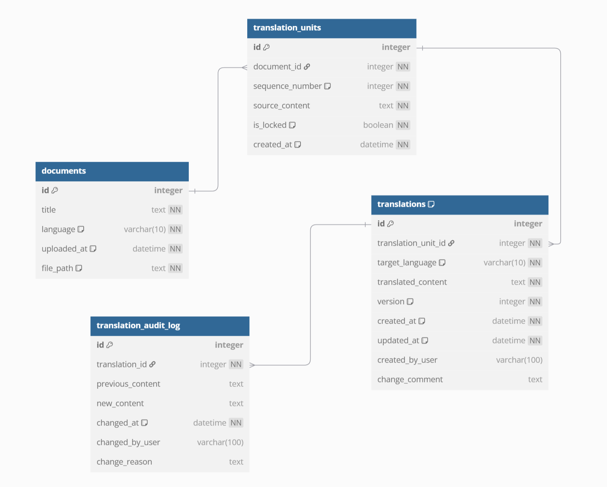

# Explaining the architecture and design decisions

## ⚙️ 1. System Overview (High-Level Architecture)

At its core, Robert handles two major responsibilities:
- **Ingest and segment source documents** (upload, split into translation units)
- **Store and manage translations**, including version control

### 🧱 High-Level Architecture

- **Frontend (React App)**
    - Simple forms for uploading files, listing translation units, editing translations, etc.
    - Communicates with the backend via HTTP (API calls).

- **Backend (PHP Application – API only)**
    - Handles business logic (Controller + Model, no View).
    - Receives requests (upload, list units, save translations), orchestrates services.
    - Uses SQL/ORM to interact with the database.

- **Database (SQLite/MySQL/PostgreSQL)**
    - Stores metadata about documents, translation units, translations, language codes, and version history.

- **File Storage (uploads/directory/cloud)**
    - Stores original uploaded files (e.g., .txt, .docx).
    - Optionally stores exported translated documents.

## 🌐 2. Handling Multilingual Content
Because Robert may receive source documents in various languages (English, French, Chinese, Arabic, etc.), we need to ensure that:


### ✅ Unicode Handling
- Use `mb_*` string functions in PHP
- Ensure the database uses `utf8mb4` charset

### 🌍 Language Detection
- Automatically detect the source language (e.g., via a lightweight library or API).
- **Why?**
    - Different languages have different sentence‐segmentation rules **(e.g., Chinese does not use spaces between words; Spanish abbreviations like “Sr.” can confuse naïve segmentation).**
- Implementation suggestions:
    - Expose a `LanguageDetector` class with a `detect($text)`: string method that returns an ISO language code (e.g., `en`, `fr`, `zh`).

### ✂️ Sentence Segmentation (Sentence Splitting)
- Use **Strategy Pattern** to Create separate `Segmenter` classes per language, for example:

    ```php
    interface SegmenterInterface {
        public function splitIntoUnits(string $text): array;
    }

    class EnglishSegmenter implements SegmenterInterface {
        public function splitIntoUnits(string $text): array {
            // e.g., preg_split('/(?<=[.?!])\s+/', $text);
        }
    }

    class ChineseSegmenter implements SegmenterInterface {
        public function splitIntoUnits(string $text): array {
            // e.g., a library or a simple heuristic based on Chinese punctuation
        }
    }
    // …additional language segmenters
    ```

- At runtime, you pass the detected language to a `SegmenterFactory` **(Factory Pattern)** that returns the correct Segmenter:

    ```php
    class SegmenterFactory {
        public static function make(string $lang): SegmenterInterface {
            return match($lang) {
                'en' => new EnglishSegmenter(),
                'zh' => new ChineseSegmenter(),
                default => new DefaultSegmenter(),
            };
        }
    }
    ```

### 🧼 Normalization
- Trim whitespace, normalize line endings (`\r\n` and `\n`).

- Optionally normalize diacritics (for languages with accented characters) if required for consistent storage.

- Store both the **raw** sentence and a **normalized** version if you plan on fuzzy‐matching or conducting `TM (Translation Memory)` lookups.

## 🧱 3. Design Patterns to Ensure Scalability, Maintainability, and Flexibility

Below are the key design patterns we recommend, along with explanations:

| Pattern        | Purpose                                    |
| -------------- | ------------------------------------------ |
| **MVC**        | Separation of concerns                     |
| **Repository** | Abstract DB access                         |
| **Factory**    | Return correct class (e.g., Segmenter)     |
| **Strategy**   | Plug-in algorithms (e.g., Segmentation)    |
| **Observer**   | Notify on events (e.g., translation saved) |
| **DI (Dependency Injection)**         | Better testability and modularity          |

### 1. Model-View-Controller (MVC)

- **Model:** Represents core domain entities (e.g., Document, TranslationUnit, Translation). These are PHP classes that encapsulate data and business rules, and may interact with the database directly or via an ORM.

- **Controller:** Handles incoming API requests (e.g., UploadController, UnitController, TranslationController). It routes requests, processes input, interacts with models/services, and returns JSON responses.

- **View (API Response Layer):** Instead of rendering UI templates, this layer formats and returns structured *JSON* responses to the frontend (React app or other clients).

**Why MVC in an API?** 

It separates concerns:

- **Models** handle business and database logic.

- **Controllers** manage request routing and coordination.

- **Views** are replaced by *JSON* responses, ensuring a clean API for frontend consumption.

### 2. Repository Pattern
- Abstracts database CRUD calls behind a repository interface, e.g.:

    ```php
    interface TranslationUnitRepositoryInterface {
        public function save(TranslationUnit $unit): void;
        public function findByDocument(int $documentId): array; // returns TranslationUnit[]
        public function findById(int $id): ?TranslationUnit;
    }
    class SQLiteTranslationUnitRepository implements TranslationUnitRepositoryInterface {
        // uses PDO to implement each method
    }

    ```
    **Why?** If tomorrow you switch from SQLite to MySQL or even a NoSQL store, you only need to write another repository implementation; controllers/services never change.

    **Laravel’s Eloquent ORM and service container let you bind repositories easily, enabling database swaps without changing controllers or services.**

### 3. Factory Pattern
- We saw it above with `SegmenterFactory`.

### 4. Strategy Pattern
- Already used for `Segmentation` above.

### 5. Observer (Event) Pattern
- Useful for “listening” to changes. For example, whenever a new translation is saved, you might fire an event:
- This keeps controllers/services from having to know about logging or cache logic, they just `dispatc` an event.


### 6. Dependency Injection (DI)
- Rather than instantiating everything inside classes, pass dependencies (PDO, Repositories, Segmenters) into constructors.
- Example:
    ```php
    class TranslationUnitService {
        private $unitRepository;
        private $segmenterFactory;
        public function __construct(
            TranslationUnitRepositoryInterface $repo,
            SegmenterFactory $factory
        ) {
            $this->unitRepository = $repo;
            $this->segmenterFactory = $factory;
        }
        // …methods that use these dependencies
    }

    ```
- **Why?** Makes unit testing easier (you can pass mock repositories), keeps code loosely coupled, and makes swapping implementations easier.


## 🗃️ 4. Database Schema (SQL)
We need to store:

1. **Original Documents**

2. **Translation Units** (source sentences/phrases/paragraphs)

3. **Translations** (possibly multiple versions in different target languages)

4. **Versioning/Audit Trails** (to revert or inspect history)

Here’s a simple Entity-Relationship diagram:


**Explanation of Key Columns:**
- **documents.language:** ISO code of the source. Helps pick correct segmentation rules.

- **translation_units.sequence_number:** Preserves original order so you can reassemble the document in the same order (e.g., for export).

- **source_content:** Raw text of each unit (e.g., a sentence or paragraph).

- **translations.target_language + version:**

    - You might have multiple target languages (French, Spanish, etc.).

    - For each target language, you may have several versions as translators revise unit by unit.

- **is_locked** (in translation_units): Optional flag if a unit is “finalized” and shouldn’t be exported or changed further.

- **translation_audit_log:** A separate table if you need detailed history (who changed what, when, and why). This is an audit trail rather than just the latest version.

## 🧾 5. Versioning Strategy
